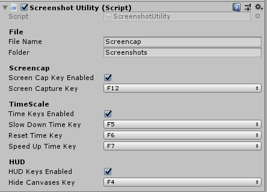

# Screenshot Utility
Unity asset package that allows you to take screenshots, speed up and slow down time, and hide HUD.

## Usage
- Clone the repo.
- Import ScreenshotUtility.unitypackage, the example folder is optional.
- Place the ScreenshotUtility prefab in your scene.
- Run your scene and press F12.
- Find your screenshot in projectRoot/Screenshots
- Use the inspector to change the file name, path and shortcut keys